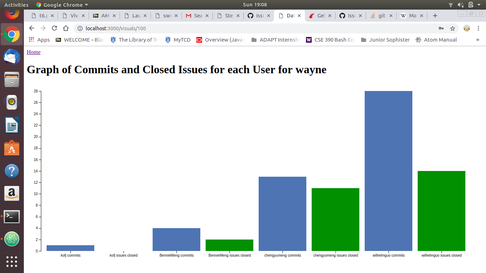

# cs3012-software-eng
Repository for CS3012 Software Engineering

Code for the LCA assignment is in the lca directory

The software engineer biography is margaret-hamilton.pdf

The measuring software engineering report is software-eng-report.pdf

The data visualisation is in github-access/data-vis. It is necessary to have Ruby and Ruby on Rails installed to run this application. When the repository is cloned navigate to the folder, then run "bin/rails db:migrate RAILS_ENV=development". Afterwards run "bin/rails server" and navigate to localhost:3000 in a web browser.

The visualtion is a bar chart that compares the amount of commits a contributor to a public repository has made compared with the amount of issues they've closed. The purpose of the comparison is to highlight how many commits are trivial and don't necessarily add much value to the codebase. An example of the visualisation produced on the repository wayne owned by Qihoo360 is given:

Note: The first time a repository is added is when the data is pulled from the GitHub API, so it can take a while. Thereafter the data is stored in a database so requests to see the visualisation won't take as long.
